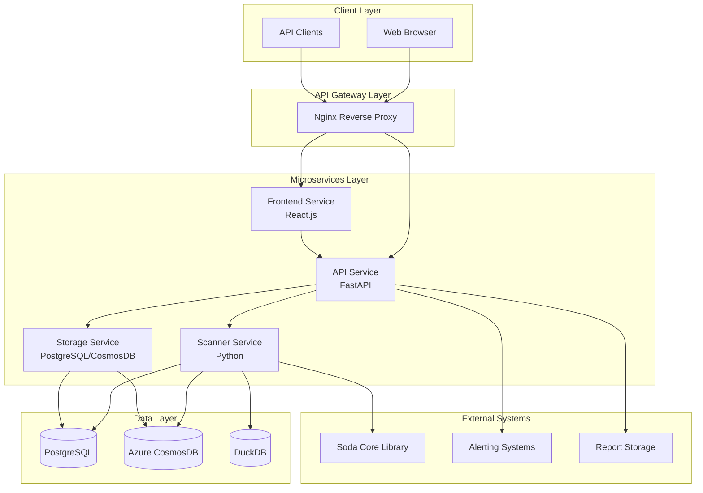

# Data Quality Platform - Architecture Document

## Overview

The Data Quality Platform is a microservices-based enterprise solution for automated data quality monitoring and validation. It leverages Soda Core for comprehensive data quality checks and provides both API and web interfaces for data quality management.

## Architecture Principles

- **Microservices**: Each service has a single responsibility and can be deployed independently
- **API-First**: All functionality is exposed through REST APIs
- **Event-Driven**: Asynchronous processing for long-running tasks
- **Containerized**: All services run in Docker containers
- **Scalable**: Horizontal scaling support through Kubernetes
- **Observable**: Comprehensive logging, monitoring, and health checks

## System Architecture



## Service Components

### 1. Frontend Service
- **Technology**: React.js, Node.js
- **Port**: 3000
- **Responsibilities**:
  - User interface for data quality management
  - File upload interface
  - Dashboard and reporting views
  - Real-time status monitoring

### 2. API Service
- **Technology**: FastAPI, Python
- **Port**: 8000
- **Responsibilities**:
  - REST API endpoints
  - Request validation and routing
  - Authentication and authorization
  - Background task management
  - Health monitoring

### 3. Scanner Service
- **Technology**: Python, Soda Core
- **Responsibilities**:
  - Data quality scan execution
  - Soda check processing
  - Result aggregation
  - Report generation

### 4. Storage Service
- **Technology**: PostgreSQL/CosmosDB
- **Responsibilities**:
  - Scan result persistence
  - Historical data storage
  - Configuration management
  - Audit logging

## Data Flow

1. **File Upload Flow**:
   ```
   User → Frontend → API → File Processing → Scanner → Storage → Response
   ```

2. **Dynamic Scan Flow**:
   ```
   User → Frontend → API → Check Generation → Scanner → Storage → Response
   ```

3. **Report Generation Flow**:
   ```
   User → Frontend → API → Storage → Report Generation → Response
   ```

## Technology Stack

### Frontend
- React 18.2.0
- Axios for API calls
- Lucide React for icons
- CSS3 with modern layouts

### Backend
- Python 3.11
- FastAPI framework
- Pydantic for validation
- Soda Core 3.4.3 for data quality

### Database
- PostgreSQL 16 (primary)
- Azure CosmosDB (alternative)
- DuckDB for in-memory processing

### Infrastructure
- Docker & Docker Compose
- Nginx for reverse proxy
- Kubernetes (production deployment)
- Helm charts

### Monitoring & Observability
- Health checks (built-in)
- Structured logging
- Prometheus metrics (future)
- Distributed tracing (future)

## Security Considerations

- **API Security**: CORS configuration, input validation
- **Container Security**: Non-root users, minimal base images
- **Network Security**: Service mesh isolation (future)
- **Data Security**: Encryption at rest and in transit
- **Access Control**: Role-based access control (future)

## Deployment Architecture

### Development Environment
- Docker Compose with all services
- Hot reloading for development
- Local database instances

### Staging Environment
- Kubernetes cluster
- CI/CD pipelines
- Automated testing

### Production Environment
- Multi-zone Kubernetes
- Load balancers
- Database replication
- Backup and recovery

## Scalability Considerations

- **Horizontal Scaling**: Stateless services can be scaled horizontally
- **Database Scaling**: Read replicas and sharding support
- **Caching**: Redis for session and result caching (future)
- **CDN**: Static asset delivery (future)

## Monitoring and Alerting

- **Application Metrics**: Response times, error rates, throughput
- **Infrastructure Metrics**: CPU, memory, disk usage
- **Business Metrics**: Scan success rates, data quality scores
- **Alerting**: Email, Slack, PagerDuty integration

## Future Enhancements

- **Service Mesh**: Istio for advanced traffic management
- **API Gateway**: Kong or Traefik for advanced routing
- **Event Streaming**: Apache Kafka for event-driven architecture
- **Machine Learning**: Automated anomaly detection
- **Multi-Cloud**: Support for AWS, GCP deployments